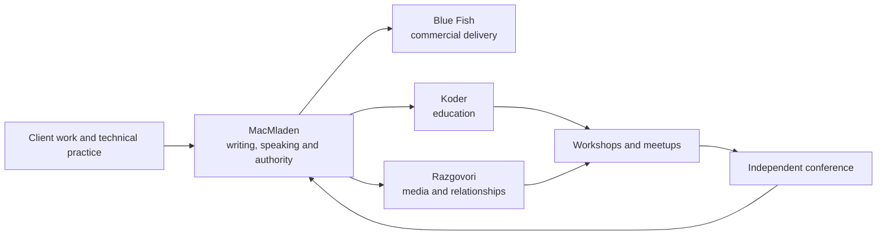

My direct opinion: you should absolutely build this ecosystem—but you should not attempt to launch five fully developed websites now.

The right near-term outcome is:

- one excellent, current MacMladen site;
- one concise, credible Blue Fish site;
- one honest Koder landing page;
- one clear Razgovori pre-launch page;
- no public conference site yet.

That is not a reduction of the vision. It is the order that allows the vision to become real.

You are not starting from zero. You are starting from accumulated but hidden capital: decades of technical experience, community work, workshops, conference organization, agency history, teaching, design knowledge, and a distinctive personal story. The urgent problem is that none of this is currently assembled into a clear public argument.

## 1. What I see now

The public footprint confirms your diagnosis.

The current [Blue Fish site](https://bluefish.rs/) still presents Apple products, an online store, service and price lists, with a 2011 copyright. A prospective Drupal, Next.js or consulting client could reasonably conclude that Blue Fish no longer operates in the field you want it to occupy.

The [Koder repository](https://github.com/macmladen/koder) is still largely the original Chronark portfolio template, including its author, projects and copy. That explains why the landing page feels puzzling: it has an attractive visual atmosphere but no real Koder proposition underneath it.

The public [MacMladen repository](https://github.com/macmladen/macmladen.github.io) shows the attempted transition: legacy Jekyll material, presentations, and a Drupal scaffold using the Next integration, but not yet a coherent, publicly delivered Next frontend. The old About text is dated, but it contains something valuable that must not be lost: TI-57, TRS-80, Commodore, DTP, typography, Apple, early networks, the web, Drupal. That is a memorable life in technology. It needs editing and structuring, not erasing.

Meanwhile, your external proof is substantial. Your public profile identifies you as an Acquia-certified Drupal/front-end specialist and Drupal Serbia co-founder, while community records show the Novi Sad camp, launch parties and continuing meetups. Your GitHub contains recent DDEV and Next.js/Drupal workshop material. [LinkedIn](https://rs.linkedin.com/in/macmladen), [Drupal Serbia activity](https://groups.drupal.org/serbia).

So the central problem is not lack of credentials. It is lack of presentation, selection and current context.

There is also genuine urgency. WordCamp Belgrade is on 18–19 September 2026, aimed at developers, designers, freelancers, agency owners and others across the digital industry. The speaker deadline was 31 July. From today, you have about 45 days until the event—but you should assume that someone could inspect your profile this week, not in September. [WordCamp Belgrade speaker call](https://belgrade.wordcamp.org/2026/en/call-for-speakers/).

## 2. The real vision

The five properties make sense if they are understood as different expressions of one body of work:

> Build. Explain. Connect. Convene.

- MacMladen establishes the person, point of view and authority.
- Blue Fish turns that authority into commercial delivery.
- Koder turns knowledge into education.
- Razgovori turns curiosity and relationships into media.
- The conference eventually turns the community into a shared physical institution.

The system should not make people think, “Mladen has five half-started ventures.” It should make them think:

> “Mladen builds serious digital systems, explains what he learns, talks to interesting people, and creates places where those people meet.”

That is coherent. In fact, it is much more differentiated than “senior Drupal developer” or “full-service digital agency.”

The reinforcing loop looks like this:



Client work creates experience. Experience creates articles, talks and training. Teaching and conversations create relationships. Relationships create meetups. Meetups validate the conference. The conference increases trust, reach and opportunity, which feeds future work.

That is the ecosystem.

## 3. The critical brand decision

I would use an “endorsed family of brands,” not put everything underneath Blue Fish and not merge everything into MacMladen.

| Property | Its job | Primary audience | Primary action |
|---|---|---|---|
| MacMladen | Personal authority and relationship | Clients, employers, organizers, peers | Work with me / invite me |
| Blue Fish | Commercial capability and delivery | Organizations and partner agencies | Discuss a project |
| Koder | Practical education | Developers, teams, career changers | Join a workshop |
| Razgovori | Media and community relationships | Regional digital community | Listen / subscribe / suggest a guest |
| Conference | Independent shared institution | Developers, designers, marketers, product people | Attend / speak / sponsor |

They should share some design DNA, infrastructure and content, but they should not have identical designs or one giant common navigation.

They also should not all pretend to be equally mature.

MacMladen and Blue Fish are current realities that need correction. Koder and Razgovori are propositions that need validation. The conference is still a program under development.

## 4. The proposition

### The umbrella proposition

Your strongest general proposition is not Drupal, Next.js, WordPress or AI. Technologies change. Your deeper value is the combination of technical depth, communication and community-building.

A possible umbrella formulation:

> I build, explain and help people navigate complex digital systems.

Or, with more character:

> I turn complicated technology into durable products, practical knowledge and stronger communities.

In Serbian:

> Gradim, objašnjavam i povezujem ljude oko digitalnih proizvoda i otvorenih tehnologija.

This allows Drupal, Next.js, WordPress, front-end work, system architecture, DDEV, teaching and AI-assisted development to fit naturally without making you sound like you change identity every time the industry moves.

AI should appear as a current working method and field of inquiry, not as a newly attached identity. Your advantage is not “I discovered AI.” It is that you can place new AI tools within forty years of technological change, distinguish durable practice from fashion, and teach people how to use them responsibly.

### MacMladen

Possible proposition:

> I’m Mladen Đurić, a senior web developer, consultant, speaker and community organizer. I build complex content platforms, explain how they work, and help the people around them work better.

A slightly sharper version:

> I design, build and explain web platforms that need to last.

The homepage must answer, within ten seconds:

1. Who are you?
2. What do you do now?
3. Why should I believe you?
4. What can I ask you to do?
5. How do I contact you?

The site should feel personal and editorial, not like a freelancer template. Your long computing history belongs on a rich Story or About page. It should not dominate the homepage, but it is an enormous differentiator once someone wants to know you.

### Blue Fish

“We deliver solutions” is true but too generic. Almost every agency says it.

I would position Blue Fish as a senior-led digital studio or consultancy:

> Senior-led design and engineering for complex content platforms.

Or:

> Blue Fish helps organizations and partner agencies plan, modernize and deliver durable web platforms.

Its initial offers could be:

- Platform strategy and technical discovery
- Drupal and decoupled platform delivery
- Modernization, rescue and performance work
- Embedded senior development for agencies and internal teams

That is more credible and useful than a broad list containing branding, e-commerce, mobile apps, SEO, social media, AI and everything else.

Because the old legal entity is passive, the language must be exact. If Blue Fish currently operates as your professional practice, say:

> Blue Fish is an independent digital practice led by Mladen Đurić, working with trusted specialists when a project requires a broader team.

Do not imply a permanent agency team that does not currently exist. Do not use an inactive company designation in the footer unless it is legally correct to do so. “We” is reasonable when describing collaborative delivery, but the working model should be transparent.

That honesty is a commercial strength. Many clients would prefer a known senior person with a carefully assembled team over an ambiguous “full-service agency.”

### Koder

Koder should not begin as a giant educational platform, coding library, community, bootcamp, course marketplace and publication. That is a future product map, not a launch scope.

Begin with:

> Practical workshops for developers and teams. Learn by building something real.

The first offerings should come directly from evidence you already have:

- DDEV workflows
- Drupal and Next.js integration
- Modern Drupal development
- AI-assisted development with CLI tools
- Possibly technical foundations for people moving beyond no-code tools

Launch with one or two real workshops, even if dates are “register interest.” A real curriculum outline is more valuable than twenty empty course categories.

Koder should be Serbian-first. Selected corporate training material can be bilingual or English where there is demand.

### Razgovori

Razgovori cannot be justified only as a promotional vehicle. Promotion can be an outcome, but listeners need an independent promise.

A suitable editorial thesis might be:

> Conversations with people shaping digital work in Serbia and the region—what they build, how they work, and what they learned along the way.

The distinction is important. This is not merely another technology-news podcast. It can bring developers, designers, marketers, organizers, founders, educators and thoughtful users of AI into the same conversation.

Before announcing a regular schedule, record three pilot episodes. Launch with at least two and keep one ready. That protects you from the familiar one-episode podcast graveyard.

The initial site needs only:

- the editorial promise;
- who is behind it;
- what kinds of guests and subjects to expect;
- email subscription;
- a guest nomination form;
- links to the episodes once published.

### The conference

The conference should not be a Blue Fish marketing event. It should be visibly independent and jointly governed. MacMladen, Koder and Razgovori can support it, but the event must feel as though it belongs to its participants and organizing team.

Its working proposition could be:

> A regional gathering where code, design, marketing, product and AI meet around the realities of making digital work.

That is broad enough to escape CMS tribalism but focused enough not to become a generic business conference.

The unique idea is not “all digital topics.” That is too broad. The idea is that the disciplines which must cooperate in real work rarely meet as equals at technical events.

Before naming and branding it, you and Slobodan should settle:

- mission and intended audience;
- ownership of the event and brand;
- decision rights;
- finances and personal liability;
- expected time commitments;
- what happens if one founder withdraws;
- whether it is commercial, nonprofit or community-led;
- the minimum evidence required for an October 2027 go-ahead.

Those decisions are more important than a logo.

## 5. What MacMladen must contain before WordCamp

This is your first and most important release.

### Homepage

A practical structure:

1. A current statement of who you are and what you do
2. Two calls to action: “Work with me” and “Invite me to speak”
3. A short proof strip
4. Three selected projects or case studies
5. Selected talks and workshops
6. Community work
7. Recent writing
8. Current availability and contact
9. Short introduction to Blue Fish, Koder and Razgovori

The proof strip could include verifiable facts such as Drupal experience, certifications, Drupal Serbia, conference organization and international workshops. Do not make it a wall of technology logos.

### Work

Publish three strong case studies rather than fifteen project thumbnails.

Each should explain:

- the client or type of organization;
- the actual problem;
- your role and the team context;
- important constraints;
- what you decided and why;
- what you built;
- the result;
- technologies, as supporting information;
- what you learned.

If contracts prevent naming clients or publishing metrics, use anonymized but concrete accounts. “A European publishing organization with several editorial teams” is more credible than vague claims about “innovative solutions.”

### Speaking

This deserves a proper section, not a line in the CV.

Include:

- topics you speak about;
- past talks and workshops;
- event, year and location;
- slides, video and materials where available;
- short and long biographies;
- downloadable headshots;
- organizer contact;
- languages;
- format preferences.

Your recent DDEV and Next.js/Drupal workshop repositories are valuable proof. They should become well-presented talk records rather than remain discoverable only by people browsing GitHub.

If accepted for WordCamp, create a dedicated page for the session containing the abstract, resources, references, slides and later the recording. Put its URL and QR code on the opening and closing slides.

### CV and About

Maintain both:

- an HTML CV optimized for reading and linking;
- a short downloadable PDF for recruiters, clients and organizers;
- a separate long-form personal story.

The old About page should be mined for distinctive material, but rewritten from your present viewpoint. Keep the early computing, typography, Mac and humanities thread. Remove details that no longer represent you or that distract from the present purpose.

## 6. The shared content system

Your Drupal/Next plan is strategically sensible because the same real-world objects appear on multiple sites.

A talk can appear on MacMladen, be offered as a Koder workshop, generate a Razgovori episode and later belong to the conference program. A client project can appear as a personal work record and as a Blue Fish case study—but with different framing.

I would use one Drupal installation as the editorial system, not five CMS installations.

Core content types:

- Person
- Brand or organization
- Project
- Case study
- Service or offering
- Talk
- Event
- Workshop or course
- Article
- Podcast episode
- Resource
- Testimonial

Every item should have:

- owning brand;
- additional channels where it may appear;
- language;
- canonical URL/domain;
- publication status;
- topics and capabilities;
- relationships to people, organizations, events and projects.

That prevents copy-pasting and allows each frontend to select and frame shared material.

The current Next.js for Drupal tooling explicitly supports multi-site use, previews, internationalization and on-demand publishing, so this is aligned with the platform rather than a custom workaround. [Next.js for Drupal](https://next-drupal.org/), [Drupal project page](https://www.drupal.org/project/next).

### Repository structure

Long-term, I would prefer a monorepo resembling:

```text
apps/
  macmladen/
  bluefish/
  koder/
  razgovori/
  conference/       # only when approved

packages/
  content-client/
  ui-foundations/
  analytics/
  seo/
  configuration/

drupal/
  composer.json
  config/
  web/modules/custom/
```

The sites should share:

- Drupal client and types;
- preview and revalidation logic;
- accessibility primitives;
- analytics and consent handling;
- SEO and structured-data utilities;
- deployment conventions.

They should not share their entire visual identity. MacMladen should feel personal and editorial; Blue Fish precise and commercial; Koder instructional; Razgovori conversational and human.

### The important qualification

Do not allow Drupal architecture to delay the first credible homepage.

Use this decision rule:

> If the existing CMS can publish and preview a basic page within two days, use it. If not, ship the first MacMladen release with local structured content or MDX and connect it to Drupal immediately afterward.

A five-page site does not need to wait for the perfect universal content model. The first vertical slice—one project, one talk, one article flowing from Drupal to production—is more valuable than weeks spent modelling every possible conference and podcast field.

## 7. Content should be the operating system

The technology is not the scarce resource. Editorial selection is.

You need one source asset to produce several useful outputs:

- a project becomes a Blue Fish case study;
- its architectural lesson becomes a MacMladen article;
- that article becomes a talk;
- the talk becomes a Koder workshop;
- a disputed or human part of the subject becomes a Razgovori conversation;
- the strongest conversations become possible meetup or conference themes.

This is not mechanical reposting. Each property answers a different question:

- MacMladen: What do I think and know?
- Blue Fish: What outcome can we deliver?
- Koder: What can you learn and practice?
- Razgovori: Who else should we hear from?
- Conference: What should we explore together?

Use one mailing infrastructure with segmented consent rather than immediately operating four newsletters. Let people select interests such as writing, workshops, podcast and events. Do not subscribe a Blue Fish contact automatically to every project.

For SEO and clarity, every piece must have one canonical home:

- personal essays and talks: MacMladen;
- commercial case studies: Blue Fish;
- curricula and teaching resources: Koder;
- episodes and transcripts: Razgovori;
- schedules and event information: conference site.

Other sites can publish summaries and link to the canonical item.

## 8. The urgent plan

### 4–6 August: credibility rescue

Publish a current MacMladen homepage as quickly as possible—even if the deeper integration is unfinished.

It needs:

- current name, portrait and positioning;
- what you do now;
- three strong proof points;
- selected work;
- speaking and community work;
- current contact details;
- correct metadata and social preview image.

At the same time, collect the raw material:

- current CV;
- short and long biography;
- good portrait and stage photographs;
- list of talks, workshops and meetups;
- ten possible projects;
- testimonials and client permissions;
- links to slides, videos and repositories;
- current service preferences and availability.

### 7–11 August: MacMladen v1

Complete:

- Home
- Work
- Speaking
- About
- Writing
- Contact
- HTML and PDF CV

Publish three case studies or at least three substantial project records. Migrate only a few genuinely valuable old articles. Preserve old URLs with redirects; do not move twelve years of material indiscriminately.

### 12–18 August: Blue Fish v1

Replace the Apple retail/service identity with the current practice.

Launch:

- focused homepage;
- three service propositions;
- working model;
- two or three case studies;
- about/leadership;
- project inquiry contact.

Keep a small legacy-service notice where needed for old visitors and indexed URLs. Do not leave obsolete store and price pages looking operational.

### 19 August–1 September: content and platform

- Establish the first Drupal-to-Next production content flow.
- Create shared project, case study, talk and article models.
- Add previews and revalidation.
- Create redirects from Jekyll and obsolete Blue Fish routes.
- Add structured data for Person, Organization, Article, Event and Course.
- Verify accessibility, performance, backups and form delivery.
- Establish one lightweight, privacy-conscious analytics setup.

### 2–8 September: Koder and Razgovori

Launch honest, useful landing pages.

Koder:

- proposition;
- first two workshop subjects;
- instructor evidence;
- register-interest form;
- company training inquiry.

Razgovori:

- editorial thesis;
- intended subjects and guests;
- host introduction;
- subscribe and suggest-a-guest forms;
- pilot announcement only if recording is genuinely underway.

These pages can be visually polished, but they should not simulate activity that does not yet exist.

### 9–17 September: WordCamp readiness

- Update every public bio and social profile to match.
- Verify all domain redirects and contact links.
- Prepare short links and QR codes.
- Create the session resources page if selected.
- Test the sites on phones and poor connections.
- Prepare a one-sentence self-introduction for networking.
- Ensure Blue Fish has a commercial path for people who ask about work.
- Ensure Koder has a path for people who ask about training.
- Remove every leftover demo project, template name and obsolete claim.

Whether you are selected as a presenter or attend as a participant, this work still pays off. The conference is a forcing function, not the only reason to become visible.

## 9. The route to October 2027

### Q4 2026: establish consistency

- Publish two or three excellent Blue Fish case studies.
- Maintain a sustainable MacMladen writing rhythm.
- Run one Koder pilot workshop.
- Record three Razgovori pilots and test the production workflow.
- Agree with Slobodan on the conference mission and governance.
- Do not announce a large event yet.

### Q1 2027: validate the community layer

- Publish the first limited Razgovori season.
- Run recurring small meetups or recorded live conversations.
- Deliver at least two Koder workshops.
- Observe which subjects and audience combinations produce real energy.
- Start private sponsor and venue conversations.

The meetups are not miniature conferences. They are research: who comes, who returns, which disciplines mix well, which speakers draw interest, and whether you have a dependable organizing group.

### Q2 2027: conference go/no-go

Proceed only when you have:

- a reliable core organizing team;
- defined decision-making and finances;
- evidence of repeat local participation;
- plausible sponsorship;
- a venue and budget model;
- an audience proposition distinct from existing events;
- enough time and capacity to deliver safely.

If the evidence is positive, secure the venue and announce the date around April or May. That gives approximately six months for sponsorship, speakers, partners, attendees and production.

### Q3 2027: public campaign

- Conference identity and site
- Sponsor prospectus
- Call for speakers
- Ticket structure
- Program themes
- Community partners
- Regular editorial collaboration with Razgovori
- Selected Koder workshops attached to the event where appropriate

October 2027 is realistic, but only if the podcast and meetups are treated as validation and relationship-building—not as five additional media obligations you must personally carry forever.

## 10. Guardrails

A few principles will prevent this from becoming another long rebuild.

1. **No placeholder universes.** A one-page site with one real promise is better than a complex site full of categories awaiting future content.

2. **No generic agency language.** “Innovation,” “passion,” “tailored solutions” and technology-logo walls conceal your actual advantages.

3. **Proof before breadth.** Three deep case studies beat thirty logos.

4. **Do not redesign your personality away.** The long, unusual history is part of the value. Edit it; do not replace it with synthetic corporate prose.

5. **Do not present AI as magic.** Show how you use it, where it helps, where it fails and how experienced judgment changes the result.

6. **Do not launch the conference as a personal funnel.** It can strengthen all the projects while remaining independently credible.

7. **Give every site one primary action.** Visitors should never have to decode the organization chart.

8. **Ship before architectural perfection.** The public site is the product; Drupal and Next are its machinery.

## Summary

The vision is sound. The danger lies only in trying to express it all at once.

Your most valuable asset is MacMladen: the person, history, expertise, voice and relationships. Blue Fish should become the clear commercial delivery vehicle around that reputation. Koder should begin with a small number of practical, evidence-backed workshops. Razgovori should develop an editorial reason to exist beyond promotion. The conference should emerge from repeated conversations and meetups as an independent shared institution.

The immediate objective is not “finish five websites before WordCamp.”

It is:

> By the time someone from WordCamp, a potential client, an organizer or a future collaborator looks you up, they should see a current person, credible proof, a clear offer and an easy next step.

The local workspace is presently an empty Git repository, while the public MacMladen repository has the legacy/new-work branch split described above. Before implementation, the exact working repository and branch should be brought into the workspace. From there, I would start with the MacMladen credibility release, then Blue Fish, without waiting for the whole ecosystem to be architecturally complete.
